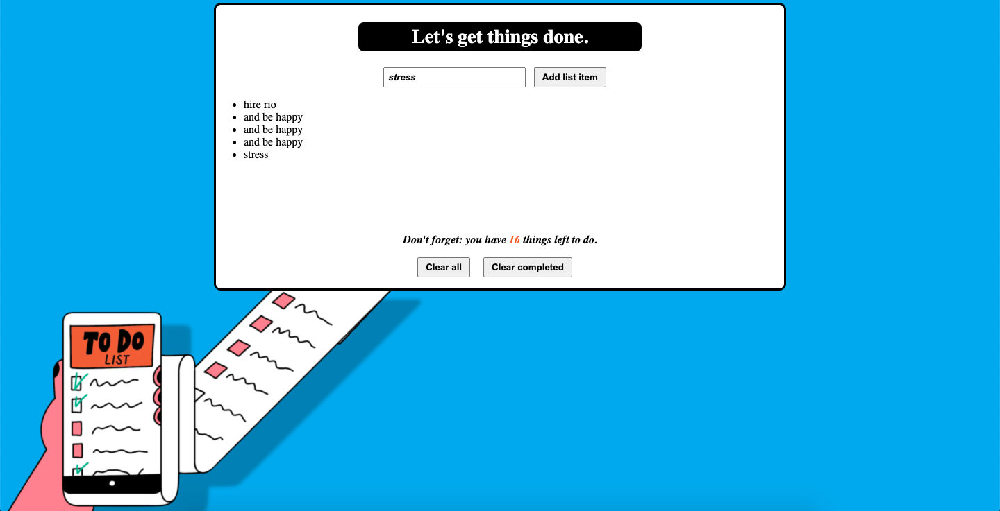

## To-do List 

This is a simple project where users can input list items, cross them out when completed, be updated on how many list items are left to complete, and clear the entire list and start from scrach. 

**Link to project:**

## How It's Made:

**Tech used:** HTML, CSS, JavaScript

I wanted to create something simple for users, AND still style it in an appealing way. I decided to do both - and created a very simply black and white input box for the actual list items, and focused on making everything outside that input section colorful. I was really comfortable with the HTML and CSS, and had a slower learning curve with Javascript but once I understood that you can give CSS a function without having to write HTML for it, I was good. 

## Lessons Learned:

If you put me in the same room with the Day-1-learning-how-to-code version of me, we would be unrecognizable to each other. I've learned that the only person I need to compare myself to, is my old self. And this to-do list is something I can proudly get behind. I'm very interested in adding more functions and giving it some more user-friendly use, but for what it is right now and where my learning journey is, this is something I'm proud of. My lesson is that you gotta take a second to live in that.
